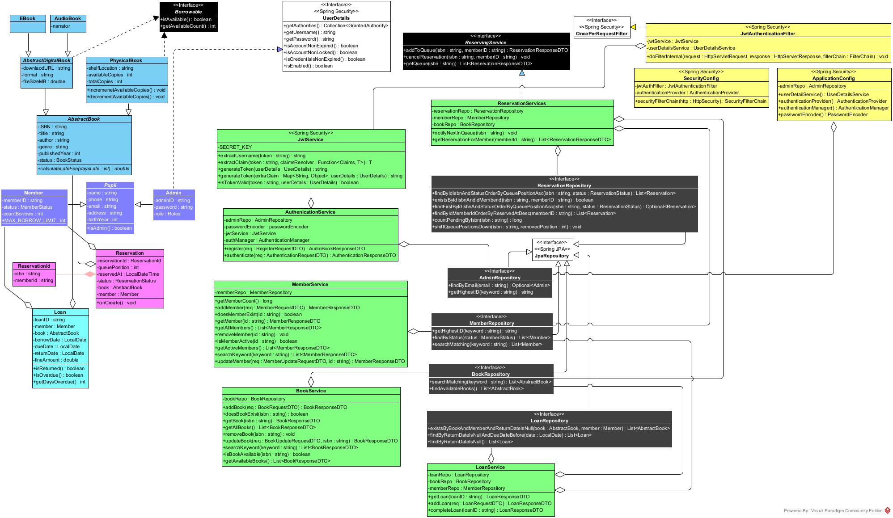
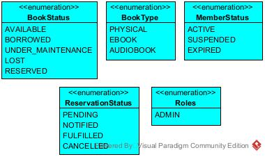
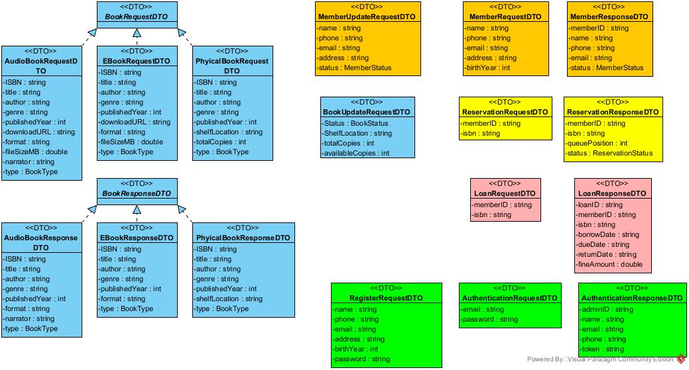
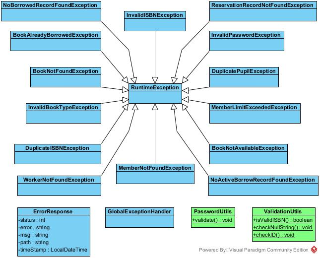

# Architecture — LMS Spring Backend

## Overview

The LMS Spring Backend is a RESTful API built with Spring Boot 4.0.7, representing a full architectural evolution from the Legacy phase. Where the Legacy system used direct JDBC embedded inside Service classes, this phase introduces a clean multi-layer architecture with Spring Data JPA for persistence, Spring Security for stateless JWT authentication, and a strict separation between API contracts (DTOs) and database entities.

The application is divided into six layers:

```
┌─────────────────────────────────────────┐
│            Controller Layer             │  REST endpoints — HTTP in, HTTP out
│   AuthController, BookController, ...   │  No business logic
├─────────────────────────────────────────┤
│              Service Layer              │  BookService, MemberService,
│                                         │  TransactionService, ReservationService
│                                         │  All business rules live here
├─────────────────────────────────────────┤
│            Repository Layer             │  Spring Data JPA interfaces
│                                         │  Custom JPQL queries where needed
├─────────────────────────────────────────┤
│              Entity Layer               │  JPA-mapped domain objects
│                                         │  Single Table Inheritance for books
├─────────────────────────────────────────┤
│            DTO / Contract Layer         │  Java records for request/response
│                                         │  Sealed interfaces + Jackson polymorphism
├─────────────────────────────────────────┤
│         Security / Filter Layer         │  JwtAuthenticationFilter
│                                         │  SecurityFilterChain, @PreAuthorize
└─────────────────────────────────────────┘
         │
         ▼
   MySQL 8 (via Hibernate / Spring Data JPA)
```

---

## Package Structure and Responsibilities

| Package | Responsibility |
|---|---|
| `com.library.controller` | Receive HTTP requests, delegate to services, return responses — no logic |
| `com.library.service` | All business rules — validation, enforcement, coordination between entities |
| `com.library.repository` | Data access via Spring Data JPA; custom queries via `@Query` |
| `com.library.entity` | JPA-mapped domain objects; no business logic inside entities |
| `com.library.dto` | Request and response records; what the API accepts and returns |
| `com.library.auth` | JWT generation, validation and `UserDetailsService` |
| `com.library.config` | `SecurityFilterChain` bean and application-level configuration |
| `com.library.exception` | Custom exceptions, Error Response DTO and `@RestControllerAdvice` global handler |
| `com.library.enums` | Fixed value sets: `Role`, `BookStatus`, `BookType`, `MemberStatus` |

---

## Inheritance Hierarchy

### Books — Single Table Inheritance

```
AbstractBook  (JPA @Entity, @Inheritance(SINGLE_TABLE))
├── PhysicalBook      — shelfLocation, totalCopies, availableCopies
└── AbstractDigitalBook  (abstract)
    ├── EBook         — downloadUrl, fileFormat
    └── AudioBook     — narrator, duration
```

All book types map to a single `books` table in MySQL, distinguished by a `type` discriminator column. This avoids costly joins when querying the full catalog while still giving each subclass its own typed fields at the Java level.

The two-level hierarchy is preserved from the Legacy phase: `AbstractDigitalBook` exists because `EBook` and `AudioBook` share a `downloadUrl` and `fileFormat` that `PhysicalBook` does not have, but differ enough to warrant separate classes.

## DTO Design

Entities are never exposed directly through the API. Every endpoint works with DTOs:

- **Request DTOs**: Java records annotated with Jakarta Bean Validation (`@NotBlank`, `@Email`, custom constraints). Validated automatically via `@Valid` on controller parameters.
- **Response DTOs**: Java records that expose only the fields the client needs — internal fields like `password` are never present.
- **Polymorphic Book DTOs**: A sealed interface (`BookResponse`) with permitted subtypes (`PhysicalBookResponse`, `EBookResponse`, `AudioBookResponse`). Jackson deserializes to the correct subtype using a `type` discriminator field, mirroring the entity hierarchy without coupling the client to JPA internals.

```java
// Example sealed interface for polymorphic response
sealed interface BookResponse permits PhysicalBookResponse, EBookResponse, AudioBookResponse {}
```

---

## Security Architecture

### Components

| Component | Responsibility |
|---|---|
| `JwtService` | Generate, sign (HS256), and validate JWT tokens using `jjwt` |
| `JwtAuthenticationFilter` | Intercept every request, extract Bearer token, validate, populate `SecurityContext` |
| `UserDetailsServiceImpl` | Load `Member` by username from the database for authentication |
| `SecurityConfig` | Define `SecurityFilterChain` — which routes are public, which require which roles |

### Filter Chain Flow

```
Incoming HTTP Request
        │
        ▼
JwtAuthenticationFilter
        │  1. Extract "Authorization: Bearer <token>" header
        │  2. Parse and validate JWT (signature, expiry)
        │  3. Load UserDetails via UserDetailsServiceImpl
        │  4. Set UsernamePasswordAuthenticationToken in SecurityContext
        ▼
SecurityFilterChain (route-level rules)
        │  /api/auth/**       → permitAll()
        │  /api/books         → authenticated()
        │  /api/members/**    → authenticated()
        │  ...
        ▼
Controller → Service → Repository → MySQL
```

### JWT Lifecycle

```
POST /api/auth/login { username, password }
        │
        ▼
UserDetailsServiceImpl.loadUserByUsername()
BCryptPasswordEncoder.matches()
        │
        ▼
JwtService.generateToken(userDetails)
  → signs with HS256 using secret from application.properties
  → embeds: subject (username), roles, issued-at, expiry (24h default)
        │
        ▼
Response: { "token": "eyJ..." }

── subsequent requests ──────────────────────
Authorization: Bearer eyJ...
        │
        ▼
JwtAuthenticationFilter.doFilterInternal()
  → JwtService.extractUsername()
  → JwtService.isTokenValid()
  → SecurityContextHolder.setAuthentication()
```

---

## Key Design Decisions

**Why Single Table Inheritance for books instead of Joined or Table-Per-Class?**
Single Table Inheritance means all book types live in one table with nullable columns for type-specific fields. This avoids joins on every book query — a significant win when listing the full catalog. The trade-off (nullable columns for type-specific fields) is acceptable given the small number of book types and that nullable fields are documented clearly in the schema.

**Why DTOs instead of exposing entities directly?**
Exposing JPA entities through a REST API creates several problems: lazy-loading exceptions during serialization, accidental exposure of sensitive fields (e.g. `password`), and tight coupling between the database schema and the API contract. DTOs decouple these concerns — the entity can change internally without breaking clients, and the response shape is explicitly controlled.

**Why sealed interfaces for `BookResponse`?**
The book hierarchy has a fixed, known set of subtypes. A sealed interface makes that exhaustiveness visible at compile time — `switch` expressions on `BookResponse` are exhaustive without a default branch. It also signals clearly to anyone reading the code that no other subtypes exist or are expected, which is exactly true for this domain.

**Why `ddl-auto=update` instead of `validate`?**
During active development, `update` lets Hibernate adjust the schema automatically as entities evolve, avoiding the need to manually sync migration scripts on every change. Once the schema stabilises before a production release, this should be switched to `validate` (or Flyway/Liquibase introduced) to prevent unintended schema changes.

---

## Data Flow — Borrow a Book

```
POST /api/transactions/borrow  { isbn, memberId }
        │
        ▼
TransactionController.borrowBook(@Valid BorrowRequest, Principal)
        │
        ▼
TransactionService.borrowBook(isbn, memberId)
        │
        ├── memberRepository.findById(memberId)     → throws MemberNotFoundException
        ├── bookRepository.findByIsbn(isbn)          → throws BookNotFoundException
        ├── book.getAvailableCopies() > 0            → throws BookNotAvailableException
        ├── activeTransactionCount(memberId) < 3     → throws MemberLimitExceededException
        │
        ├── new Transaction(member, book, dueDate)
        ├── transactionRepository.save(transaction)
        ├── book.setAvailableCopies(available - 1)
        └── bookRepository.save(book)
        │
        ▼
TransactionController returns 201 Created + TransactionResponse
```

---

## Data Flow — JWT Authentication

```
POST /api/auth/login  { username, password }
        │
        ▼
AuthController.login(@Valid LoginRequest)
        │
        ▼
AuthService.authenticate(username, password)
        │
        ├── AuthenticationManager.authenticate()
        │       └── UserDetailsServiceImpl.loadUserByUsername()
        │               └── memberRepository.findByUsername()
        │                       → throws UsernameNotFoundException
        │       └── BCryptPasswordEncoder.matches()
        │               → throws BadCredentialsException
        │
        └── JwtService.generateToken(userDetails)
        │
        ▼
AuthController returns 200 OK + { token: "eyJ..." }
```

---

## Persistence Layer — Spring Data JPA

### Technology

- **Database**: MySQL 8
- **ORM**: Hibernate (via Spring Data JPA)
- **DDL strategy**: `ddl-auto=update`
- **Driver**: MySQL Connector/J

### How it works

Each entity has a corresponding Spring Data JPA `Repository` interface. For standard operations (`findById`, `save`, `delete`, `findAll`), no SQL is written at all — Spring Data generates the implementation at startup. For domain-specific queries, `@Query` with JPQL is used.

```java
// Example: custom query in BookRepository
@Query("SELECT b FROM AbstractBook b WHERE " +
       "LOWER(b.title) LIKE LOWER(CONCAT('%', :query, '%')) OR " +
       "LOWER(b.author) LIKE LOWER(CONCAT('%', :query, '%')) OR " +
       "b.isbn LIKE CONCAT('%', :query, '%')")
List<AbstractBook> searchBooks(@Param("query") String query);
```

### How entities map to tables

| Entity | Table | Strategy |
|---|---|---|
| `AbstractBook` / subtypes | `books` | Single Table Inheritance (`dtype` column) |
| `Member` | `members` | Standard `@Entity` |
| `Transaction` | `transactions` | Standard `@Entity` with FK to `members` and `books` |
| `Reservation` | `reservations` | Standard `@Entity` with FK to `members` and `books` |
| `Admin` | `admins` | Standard `@Entity` |

### Trade-off vs Legacy JDBC

The Legacy phase embedded SQL directly in Service classes — straightforward but gave Services two responsibilities (business logic + data access). This phase separates those concerns cleanly: Services contain only business rules, Repositories contain only data access. The result is that Services are easier to unit test (repositories can be mocked), and SQL queries are centralised rather than scattered across the codebase.

---

## Diagrams

### 1. LMS



### 2. Enums



### 3. DTOs



#### 4. Exceptions and Utilities



---

## What's Not Here Yet

This document reflects the current state of the Spring Backend. The following will be addressed in upcoming phases:

- **JavaFX Frontend (Phase 3)**: The `LMS-JavaFX-Frontend` module will connect to this API via Java's `HttpClient`, attaching JWT Bearer tokens on every request. Since the API contract is DTO-based, the frontend has no knowledge of JPA internals.