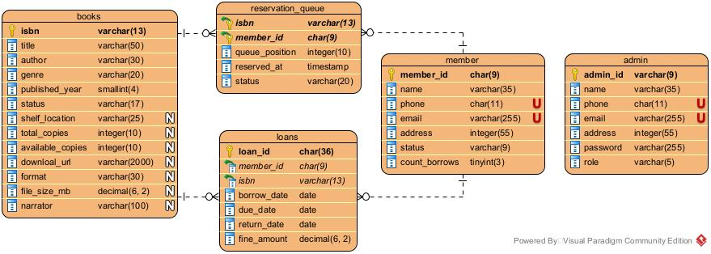

# Database — LMS Spring Backend

## Overview

The LMS Spring Backend uses **MySQL 8** as its persistence layer, managed via **Spring Data JPA** with Hibernate as the ORM. The database is named `lms_db` and contains five tables covering books, admins, members, transactions, and reservations.

Compared to the Legacy phase, two structural changes were made:

- `workers` renamed to `admins` — better reflects the entity name in the Java layer
- `salt_n_hash` removed — password credential storage is now handled directly in the `admins` table as a BCrypt hash via Spring Security's `BCryptPasswordEncoder`. A separate credentials table is no longer needed.

See [`sql/schema.sql`](../sql/schema.sql) for the complete SQL to recreate the database from scratch.

---

## Setup

### Prerequisites

- MySQL 8.0+
- MySQL Connector/J on the classpath (declared in `pom.xml`)

### Creating the Database

```bash
mysql -u root -p < sql/schema.sql
```

Or manually in MySQL Workbench / shell:

```sql
CREATE DATABASE IF NOT EXISTS lms_db;
USE lms_db;
-- then run the table definitions from schema.sql
```

### Connection

Database connection details are configured in `src/main/resources/application.properties`:

```properties
spring.datasource.url=jdbc:mysql://localhost:3306/lms_db
spring.datasource.username=YOUR_USERNAME
spring.datasource.password=YOUR_PASSWORD

spring.jpa.hibernate.ddl-auto=update
spring.jpa.show-sql=true
```

> ⚠️ Never commit `application.properties` with real credentials. Add it to `.gitignore`.

---

## Tables

### `books`

Stores all book records across all types using a Single Table Inheritance strategy. Book-type-specific columns are nullable — only the columns relevant to the book's `dtype` are populated.

| Column | Type | Nullable | Description |
|---|---|---|---|
| `isbn` | `VARCHAR(13)` | NO | Primary key |
| `type` | `VARCHAR(31)` | NO | JPA discriminator — `PhysicalBook`, `EBook`, `AudioBook` |
| `title` | `VARCHAR(50)` | NO | Book title |
| `author` | `VARCHAR(50)` | NO | Author name |
| `genre` | `VARCHAR(20)` | NO | Genre |
| `published_year` | `SMALLINT` | NO | Publication year |
| `book_status` | `ENUM` | NO | `AVAILABLE`, `BORROWED`, `RESERVED`, `LOST`, `UNDER_MAINTENANCE` |
| `book_type` | `ENUM` | NO | `PHYSICAL`, `EBOOK`, `AUDIOBOOK` |
| `shelf_location` | `VARCHAR(25)` | YES | `PhysicalBook` only |
| `total_copies` | `INT` | YES | `PhysicalBook` only |
| `available_copies` | `INT` | YES | `PhysicalBook` only |
| `download_url` | `VARCHAR(2000)` | YES | `EBook` / `AudioBook` only |
| `file_format` | `VARCHAR(30)` | YES | `EBook` / `AudioBook` only |
| `file_size_mb` | `DOUBLE` | YES | `EBook` / `AudioBook` only |
| `narrator` | `VARCHAR(100)` | YES | `AudioBook` only |

**JPA mapping:** `@Inheritance(strategy = InheritanceType.SINGLE_TABLE)` on `AbstractBook` with `@DiscriminatorColumn(name = "type")`. Each subclass carries `@DiscriminatorValue("PhysicalBook")` etc.

**Java mapping:** Spring Data JPA and Hibernate handle instantiating the correct subclass automatically based on `dtype` — no manual `mapResultSetToBook()` needed unlike the Legacy phase.

---

### `admins`

Stores library staff accounts. Replaces the Legacy `workers` table. The BCrypt password hash is stored directly here — the separate `salt_n_hash` table from the Legacy phase is no longer needed since `BCryptPasswordEncoder` handles salting internally.

| Column | Type | Nullable | Description |
|---|---|---|---|
| `admin_id` | `CHAR(9)` | NO | Primary key |
| `name` | `VARCHAR(35)` | NO | Full name |
| `phone` | `CHAR(11)` | YES | Contact number |
| `email` | `VARCHAR(254)` | NO | Email address |
| `address` | `VARCHAR(55)` | NO | Home address |
| `age` | `INT` | NO | Age (must be > 1910) |
| `password` | `VARCHAR` | NO | BCrypt hash — 60 chars fixed output |
| `role` | `ENUM` | NO | `ADMIN` (reserved for future RBAC expansion) |

**Constraint:** `check_age_admins` — `age > 1910`.

**Password note:** `BCryptPasswordEncoder` generates a new random salt per password internally and embeds it in the hash output. There is no need for a separate salt column or table.

**Role note:** The `role` column exists to support future Role-Based Access Control. Currently all admins carry the same `ADMIN` role — enforcement is not yet implemented.

---

### `members`

Stores registered library members. Members are **not** application users — they have no login credentials and are not part of the authentication system. This table is purely a library record for tracking borrowing, returns, and reservations.

| Column | Type | Nullable | Description |
|---|---|---|---|
| `member_id` | `CHAR(9)` | NO | Primary key |
| `name` | `VARCHAR(35)` | NO | Full name |
| `phone` | `VARCHAR(11)` | NO | Contact number |
| `email` | `VARCHAR(254)` | NO | Email address |
| `address` | `VARCHAR(55)` | NO | Home address |
| `age` | `INT` | NO | Age (must be > 1910) |
| `member_status` | `ENUM` | NO | `ACTIVE`, `SUSPENDED`, `EXPIRED` |

**Constraint:** `check_age_members` — `age > 1910`.

---

### `loans`

Records every borrow event. A row is created when a book is borrowed and updated (with `return_date` and `fine_amount`) when it is returned.

| Column | Type | Nullable | Description |
|---|---|---|---|
| `loan_id` | `CHAR(36)` | NO | Primary key (UUID) |
| `member_id` | `CHAR(9)` | NO | FK → `members.member_id` |
| `isbn` | `VARCHAR(13)` | NO | FK → `books.isbn` |
| `borrow_date` | `DATE` | NO | Date the book was issued |
| `due_date` | `DATE` | NO | Expected return date (borrow + 14 days) |
| `return_date` | `DATE` | YES | Actual return date — `NULL` while book is still out |
| `fine_amount` | `DECIMAL(5,2)` | NO | Late fee in Rs., defaults to `0.00` |

**Foreign keys:**

- `transaction_member_fk` → `members(member_id)` — `ON DELETE RESTRICT ON UPDATE CASCADE`
- `transaction_book_fk` → `books(isbn)` — `ON DELETE RESTRICT ON UPDATE CASCADE`

**Constraints:**

- `check_due_date` — `due_date > borrow_date`
- `check_return_date` — `return_date >= borrow_date`

**Active borrow check:** A transaction with `return_date IS NULL` is an active (unreturned) borrow. The 3-book member limit is enforced in `LoanService` by counting rows where `member_id = ? AND return_date IS NULL` — via a Spring Data JPA `@Query`.

**JPA note:** `loan_id` is mapped with UUID strategy rather than auto-increment, consistent with the Legacy schema.

---

### `reservations`

Tracks the reservation queue per book. Each row represents one member's place in line for a specific book.

| Column | Type | Nullable | Description |
|---|---|---|---|
| `isbn` | `VARCHAR(13)` | NO | FK → `books.isbn`, part of composite PK |
| `member_id` | `CHAR(9)` | NO | FK → `members.member_id`, part of composite PK |
| `notified` | `TINYINT(1)` | NO | `0` = not yet notified, `1` = notified (book ready) |
| `position` | `INT` | NO | Queue position for this book (1 = next in line) |

**Primary key:** Composite `(isbn, member_id)` — mapped via `@EmbeddedId` with a `ReservationId` embeddable class. A member can only reserve the same book once.

**Unique key:** `(isbn, position)` — no two members can hold the same queue position for the same book.

**Foreign keys:**
- `reservation_book_fk` → `books(isbn)` — `ON DELETE CASCADE`. Deleting a book clears its reservation queue.
- `reservation_member_fk` → `members(member_id)` — `ON DELETE RESTRICT`. A member with active reservations cannot be deleted.

---

## Relationships

```
admins ──────────────────────────── (standalone)
  (1)         password stored directly in admins table (BCrypt)

members ──────────── loans
  (1)                    (N)        member_id FK

books ────────────── loans
  (1)                    (N)        isbn FK

members ──────────── reservations
  (1)                    (N)        member_id FK

books ────────────── reservations
  (1)                    (N)        isbn FK
```

---

## Design Notes

**Why BCrypt in `admins` instead of a separate `salt_n_hash` table?**
The Legacy phase used a dedicated `salt_n_hash` table to isolate credentials from worker data. Spring Security's `BCryptPasswordEncoder` makes this separation unnecessary — BCrypt generates and embeds a unique salt per password in the hash output itself. The result is that a single `password VARCHAR` column in `admins` is both simpler and equally secure.

**Why `admins` instead of `workers`?**
The entity in the Java layer is `Admin`, so renaming the table to match keeps the naming consistent across Java, JPA, and SQL. In the Legacy phase the class was called `Admin` but the table was `workers` — this closes that inconsistency.

**Why is `Member` not an application user?**
Members are library patrons tracked for borrowing and reservation purposes only. Authentication is handled entirely through the `Admin` entity. This keeps the security layer simple — only one `UserDetails` implementation is needed, and the `members` table has no password or auth-related columns.

**Single `books` table for all book types**
Unchanged from the Legacy design. All three book types share one table with nullable type-specific columns, distinguished by the `dtype` discriminator. In the Legacy phase this discrimination was done manually in `mapResultSetToBook()`; in the Spring phase Hibernate handles it automatically.

**`transactions` as the source of truth for borrow state**
Whether a member has an active borrow is determined by querying `transactions` (`return_date IS NULL`), not by a field on the member. This avoids stale state and keeps the `members` record clean — unchanged from the Legacy design.

**`CHAR` vs `VARCHAR` for IDs**
`admin_id` and `member_id` use `CHAR(9)` (fixed-length) since IDs always follow a known fixed format. `isbn` uses `VARCHAR(13)` to accommodate both ISBN-10 and ISBN-13. `transaction_id` uses `CHAR(36)` for UUID storage.

---

## Diagram


